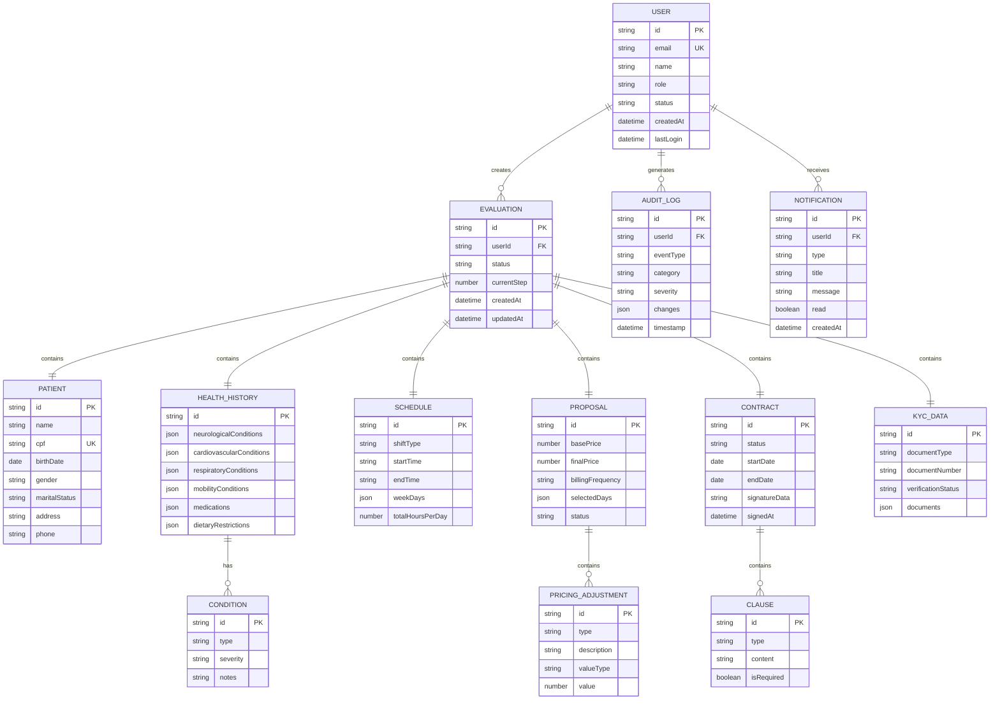

# 📊 Mãos Amigas - Modelos de Dados

> Documentação completa dos modelos de dados e tipos TypeScript

---

## 📐 Diagrama de Entidades



---

## 🔐 Tipos de Autenticação

### User
```typescript
interface User {
    id: string;              // UUID
    email: string;           // Unique
    name: string;
    role: UserRole;          // 'admin' | 'evaluator' | 'client' | 'caregiver' | 'nurse'
    status: UserStatus;      // 'active' | 'inactive' | 'pending' | 'suspended'
    avatar?: string;
    phone?: string;
    createdAt: Date;
    updatedAt: Date;
    lastLogin?: Date;
    preferences: UserPreferences;
}

type UserRole = 'admin' | 'evaluator' | 'client' | 'caregiver' | 'nurse';
type UserStatus = 'active' | 'inactive' | 'pending' | 'suspended';
```

### Permissions
```typescript
interface Permissions {
    canViewDashboard: boolean;
    canManageUsers: boolean;
    canCreateEvaluations: boolean;
    canEditEvaluations: boolean;
    canDeleteEvaluations: boolean;
    canViewReports: boolean;
    canAccessAuditLog: boolean;
    canManageSettings: boolean;
}

const ROLE_PERMISSIONS: Record<UserRole, Permissions> = {
    admin: { /* all true */ },
    evaluator: { canCreateEvaluations: true, canEditEvaluations: true, ... },
    client: { canViewDashboard: true, ... },
    caregiver: { canViewDashboard: true, canViewReports: true, ... },
    nurse: { canViewDashboard: true, canViewReports: true, ... },
};
```

---

## 📋 Tipos de Avaliação

### Evaluation
```typescript
interface Evaluation {
    id: string;
    status: EvaluationStatus;
    currentStep: number;
    discovery: DiscoveryData;
    patient: PatientData;
    healthHistory: HealthHistoryData;
    abemid: AbemidData;
    katz: KatzData;
    safetyChecklist: SafetyChecklistData;
    schedule: ScheduleData;
    proposal: ProposalData;
    evaluator: EvaluatorData;
    kycData: KYCData;
    results: EvaluationResults;
    createdAt: Date;
    updatedAt: Date;
}

type EvaluationStatus = 
    | 'draft' 
    | 'in_progress' 
    | 'pending_review' 
    | 'approved' 
    | 'rejected' 
    | 'completed';
```

### PatientData
```typescript
interface PatientData {
    name: string;
    cpf: string;
    birthDate: string;
    age?: number;
    gender: 'male' | 'female' | 'other';
    maritalStatus: MaritalStatus;
    temperament: Temperament;
    sleepQuality: SleepQuality;
    address: {
        street: string;
        number: string;
        complement?: string;
        neighborhood: string;
        city: string;
        state: string;
        zipCode: string;
    };
    phones: {
        primary: string;
        secondary?: string;
        emergency?: string;
    };
    familyContact: {
        name: string;
        relationship: string;
        phone: string;
    };
}
```

### HealthHistoryData
```typescript
interface HealthHistoryData {
    neurologicalConditions: NeurologicalCondition[];
    cardiovascularConditions: CardiovascularCondition[];
    respiratoryConditions: RespiratoryCondition[];
    mobilityConditions: MobilityCondition[];
    specialMedications: SpecialMedication[];
    dietaryRestrictions: DietaryRestriction[];
    allergies: string[];
    surgicalHistory: string[];
    hospitalizations: {
        date: string;
        reason: string;
        duration: string;
    }[];
    currentMedications: {
        name: string;
        dosage: string;
        frequency: string;
    }[];
}
```

---

## 📊 Tipos de Escalas Clínicas

### AbemidData
```typescript
interface AbemidData {
    clinicalProcedures: {
        venousPuncture: boolean;
        oxygenTherapy: boolean;
        tracheostomy: boolean;
        gastrostomy: boolean;
        catheter: boolean;
        ostomy: boolean;
        woundCare: boolean;
        // ... mais 15 itens
    };
    nursingCare: {
        medicationAdmin: boolean;
        vitalSigns: boolean;
        positioning: boolean;
        // ... mais itens
    };
}

interface AbemidResult {
    score: number;
    classification: 'low' | 'moderate' | 'high' | 'very_high';
    recommendedProfessional: 'caregiver' | 'tech_nurse' | 'nurse';
    complexityMultiplier: number;
}
```

### KatzData
```typescript
interface KatzData {
    bathing: 0 | 1;      // 0 = dependente, 1 = independente
    dressing: 0 | 1;
    toileting: 0 | 1;
    transferring: 0 | 1;
    continence: 0 | 1;
    feeding: 0 | 1;
}

interface KatzResult {
    score: number;        // 0-6
    classification: 'independent' | 'moderate' | 'dependent' | 'total_dependent';
    description: string;
}
```

---

## 💰 Tipos de Precificação

### ScheduleData
```typescript
interface ScheduleData {
    shiftType: ShiftType;           // 'day' | 'night' | '24h'
    startTime: string;              // 'HH:MM'
    endTime: string;                // 'HH:MM'
    weekDays: WeekDay[];            // ['mon', 'tue', ...]
    totalHoursPerDay: number;
    includesWeekend: boolean;
}

type ShiftType = 'day' | 'night' | '24h';
type WeekDay = 'mon' | 'tue' | 'wed' | 'thu' | 'fri' | 'sat' | 'sun';
```

### PriceBreakdown
```typescript
interface PriceBreakdown {
    baseHourlyRate: number;
    hoursPerDay: number;
    daysPerWeek: number;
    shiftsPerMonth: number;
    complexityMultiplier: number;
    nightShiftMultiplier: number;
    weekendMultiplier: number;
    professionalTypeRate: number;
    subtotal: number;
    adjustments: PricingAdjustment[];
    totalAdjustment: number;
    finalShiftCost: number;
    monthlyTotal: number;
}
```

### BillingFrequency
```typescript
type BillingFrequency = 
    | 'daily'           // Diária
    | 'specific_days'   // Dias específicos do mês
    | 'weekly'          // Semanal
    | 'biweekly'        // Quinzenal
    | 'monthly'         // Mensal
    | 'yearly';         // Anual

interface BillingConfig {
    frequency: BillingFrequency;
    selectedWeekDays?: string[];
    selectedMonthDays?: number[];
    shiftsPerPeriod: number;
    periodLabel: string;
    totalValue: number;
    unitValue: number;
}
```

---

## 📄 Tipos de Contrato

### ContractData
```typescript
interface ContractData {
    id: string;
    evaluationId: string;
    status: 'draft' | 'pending' | 'signed' | 'cancelled';
    clauses: ContractClause[];
    startDate: string;
    endDate?: string;
    signatureData?: string;     // Base64 da assinatura
    signedAt?: Date;
    signedBy: {
        name: string;
        cpf: string;
        relationship: string;
    };
}

interface ContractClause {
    id: string;
    type: ClauseType;
    title: string;
    content: string;
    isRequired: boolean;
    isDynamic: boolean;
    variables?: Record<string, string>;
}

type ClauseType = 
    | 'identification' 
    | 'object' 
    | 'obligations' 
    | 'payment' 
    | 'term' 
    | 'termination' 
    | 'confidentiality';
```

---

## 🔍 Tipos de Auditoria

### AuditLogEntry
```typescript
interface AuditLogEntry {
    id: string;
    userId: string;
    userName: string;
    eventType: AuditEventType;
    category: AuditCategory;
    severity: AuditSeverity;
    resourceType: string;
    resourceId: string;
    action: string;
    changes?: AuditChange[];
    metadata?: Record<string, unknown>;
    ipAddress?: string;
    userAgent?: string;
    timestamp: Date;
}

type AuditEventType = 
    | 'create' | 'update' | 'delete' 
    | 'login' | 'logout' 
    | 'view' | 'export' 
    | 'error';

type AuditSeverity = 'low' | 'medium' | 'high' | 'critical';
type AuditCategory = 'auth' | 'data' | 'system' | 'security';
```

---

## 🔄 Tipos de Sincronização

### SyncState
```typescript
interface SyncState {
    status: SyncStatus;
    lastSyncAt?: Date;
    pendingOperations: SyncOperation[];
    conflicts: SyncConflict[];
    isOnline: boolean;
}

type SyncStatus = 'idle' | 'syncing' | 'error' | 'offline';

interface SyncOperation {
    id: string;
    type: 'create' | 'update' | 'delete';
    resource: string;
    data: unknown;
    createdAt: Date;
    retries: number;
}

interface SyncConflict {
    id: string;
    resource: string;
    localVersion: unknown;
    remoteVersion: unknown;
    resolvedAt?: Date;
    resolution?: 'local' | 'remote' | 'merge';
}
```
